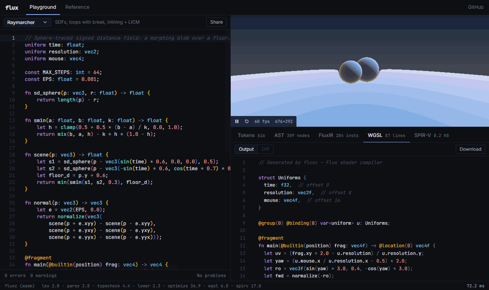
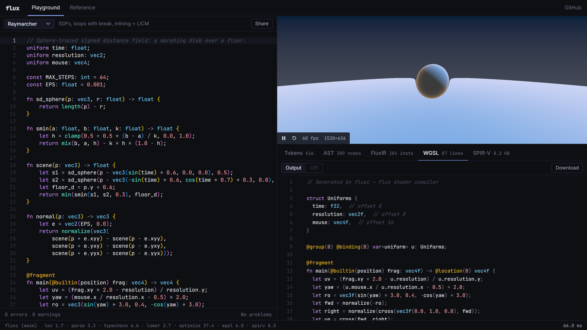

# Flux

**A statically typed shading language and compiler in C++ — with a WebGPU playground that shows every stage of compilation live.**

Flux compiles shaders through its own SSA intermediate representation, runs a set of optimization passes over it, and emits both **WGSL** and **SPIR-V**. The same compiler is built to WebAssembly, so the playground type-checks, optimizes and recompiles on every keystroke, renders the result with WebGPU, and shows exactly how each edit changed the compiled output.

<p align="center">
  <a href="https://darrelfw321.github.io/Flux/"><strong>Live playground</strong></a>
  ·
  <a href="docs/LANGUAGE.md">Language &amp; compiler reference</a>
  ·
  <a href="docs/BUILD.md">Build guide</a>
  ·
  <a href="examples/">Examples</a>
</p>

<p align="center">
  
</p>

```flux
uniform time: float;
uniform resolution: vec2;
@range(0.1, 4.0) uniform speed: float = 1.0;

fn palette(t: float) -> vec3 {
    return 0.5 + 0.5 * cos(6.28318 * (t + vec3(0.0, 0.33, 0.67)));
}

@fragment
fn main(@builtin(position) frag: vec4) -> vec4 {
    let uv = frag.xy / resolution;
    return vec4(palette(uv.x + time * speed), 1.0);
}
```

---

## What's inside

| | |
|---|---|
| **Language** | `float` / `int` / `bool`, `vec2–4`, `mat2–4`, swizzles, uniforms with `@range` / `@color` metadata, `@vertex` / `@fragment` entry points, `for` / `while` / `break` / `continue` / `discard`, 39 math built-ins |
| **Front end** | hand-written lexer and recursive-descent parser; a type checker that resolves names, infers `let` types, checks entry-point interfaces, rejects recursion and missing returns, and reports *all* errors and warnings at once |
| **FluxIR** | SSA with structured control flow — `if` / `loop` own nested regions, matching SPIR-V's merge-block rules and WGSL's statements |
| **Optimizer** | inlining, constant folding, algebraic simplification, branch folding, store→load forwarding, dead-store elimination, CSE, loop-invariant code motion, loop unrolling, DCE — run to a fixed point |
| **Backends** | readable WGSL (expressions re-nested, minimal parentheses), and SPIR-V 1.0 binaries for Vulkan with `OpLine` debug info and a `spirv-dis`-style disassembly |
| **Playground** | Monaco editor with live diagnostics and type-on-hover, a WebGPU preview with auto-generated uniform controls, and an inspector for tokens → AST → IR (pass by pass) → WGSL → SPIR-V |

### The visualizer

- **Source maps everywhere.** Move the cursor in the editor and the IR, WGSL and SPIR-V lines it produced light up; hover an output line to highlight the source it came from.
- **What did my edit change?** Each compile is diffed against the previous one: changed output lines flash, the stage tabs show `+added −removed` line counts, and a Δ view shows the full diff.
- **Pass by pass.** Step through every optimization pass that changed the IR, with a diff for each, and switch individual passes on or off to see what they buy you in the final WGSL and SPIR-V.
- **Live diagnostics.** Compiler errors and warnings appear as you type (with the last good build still rendering), and any WGSL validation error from WebGPU is mapped back to the Flux line.

<p align="center">
  
</p>

---

## Try it

**In the browser:** open the [playground](https://darrelfw321.github.io/Flux/) in a recent Chrome, Edge or Safari.

**Locally:**

```bash
# compiler
cmake -S . -B build -G Ninja -DCMAKE_BUILD_TYPE=Release
cmake --build build
./build/fluxc examples/raymarch.flux                       # WGSL to stdout
./build/fluxc examples/raymarch.flux --emit spirv -o out.spv
./build/fluxc examples/noise.flux --emit ir --stats        # optimized IR + per-pass counts

# playground (needs Emscripten for the WASM build)
emcmake cmake -S wasm -B build_wasm && cmake --build build_wasm
cp build_wasm/flux_wasm.* frontend/public/
cd frontend && npm install && npm run dev
```

See [docs/BUILD.md](docs/BUILD.md) for Windows and all CLI flags.

---

## Testing

- **Unit tests** (Catch2): lexer, parser, type checker, every optimization pass, both backends.
- **SPIR-V validation:** CTest compiles every example at `-O0` and `-O2` and runs `spirv-val --target-env vulkan1.0` on the result.
- **GPU differential test:** [`tools/gpu-difftest.cjs`](tools/gpu-difftest.cjs) renders every shader on a real GPU through WebGPU, unoptimized and optimized, and requires the images to be pixel-identical.

```bash
cmake -S . -B build -DFLUX_BUILD_TESTS=ON && cmake --build build
ctest --test-dir build --output-on-failure
```

CI runs the test suite on every push and pull request, then builds the WASM module and deploys the playground to GitHub Pages.

---

## Repo map

```
compiler/
  frontend/   lexer, parser, AST, type checker (+ uniform reflection), AST → JSON
  ir/         FluxIR, AST → IR lowering, optimization passes, printer
  backend/    WGSL and SPIR-V emitters
  driver.cpp  pipeline + JSON for the playground;  main.cpp  the fluxc CLI
  wasm_bindings.cpp  Emscripten entry point
frontend/     React + Monaco + WebGPU playground
examples/     .flux shaders (also used by the tests)
tests/        Catch2 suite, spirv-val checks, extra test shaders
tools/        GPU differential tester
docs/         language reference, build guide, media
```

## Stack

C++17 · CMake · Emscripten / WebAssembly · WebGPU · WGSL · SPIR-V · React · TypeScript · Monaco · Catch2

---

<p align="center">
  <sub>Darrel Wihandi · SE @ UW</sub>
</p>
